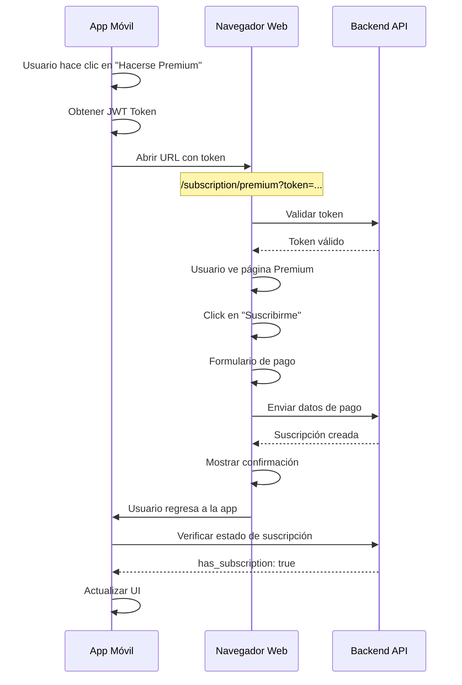

# Integración de Suscripciones - Frontend Móvil

Este documento explica cómo integrar correctamente el flujo de suscripciones Premium desde tu aplicación móvil.

## 🔑 Conceptos Clave

### Token de Autenticación
Para acceder a las páginas web de suscripción desde tu app móvil, **DEBES** incluir el token JWT del usuario en la URL.

El backend acepta el token de múltiples formas:
1. **Parámetro de URL** (Recomendado para móvil): `?token=YOUR_JWT_TOKEN`
2. Header Authorization: `Bearer YOUR_JWT_TOKEN`
3. Sesión web (para navegadores)
4. Cookie

## 📱 Flujo Completo de Suscripción

### 1. Usuario hace clic en "Hacerse Premium"

Cuando el usuario hace clic en el botón para suscribirse en tu app móvil:

```dart
// Ejemplo en Flutter/Dart
String jwtToken = await getUserToken(); // Obtén el token del usuario autenticado
String subscriptionUrl = "https://b.estoico.app/subscription/premium?token=$jwtToken";

// Abrir en navegador o WebView
await launchUrl(Uri.parse(subscriptionUrl));
```

```kotlin
// Ejemplo en Kotlin/Android
val jwtToken = getUserToken() // Obtén el token del usuario autenticado
val subscriptionUrl = "https://b.estoico.app/subscription/premium?token=$jwtToken"

// Abrir en navegador o WebView
val intent = Intent(Intent.ACTION_VIEW, Uri.parse(subscriptionUrl))
startActivity(intent)
```

```swift
// Ejemplo en Swift/iOS
let jwtToken = getUserToken() // Obtén el token del usuario autenticado
let subscriptionUrl = "https://b.estoico.app/subscription/premium?token=\(jwtToken)"

// Abrir en navegador o WebView
if let url = URL(string: subscriptionUrl) {
    UIApplication.shared.open(url)
}
```

### 2. Flujo en el Navegador Web

Una vez abierto el enlace con el token:

1. **Página Premium** (`/subscription/premium?token=...`)
   - Muestra información del plan Premium
   - Características y precio
   - Botón "Suscribirme ahora"

2. **Página de Pago** (`/subscription/payment?token=...`)
   - Formulario para ingresar datos de tarjeta
   - El token se mantiene en la URL durante toda la navegación
   - Validación y procesamiento de pago

3. **Página de Estado** (`/subscription/status?token=...`)
   - Confirma la suscripción exitosa
   - Muestra detalles de la suscripción

### 3. Verificar Estado de Suscripción

Después de que el usuario complete el flujo en el navegador, verifica en tu app si la suscripción fue exitosa:

```dart
// Ejemplo API call
Future<bool> checkSubscriptionStatus() async {
  final response = await http.get(
    Uri.parse('https://b.estoico.app/api/subscriptions/status'),
    headers: {
      'Authorization': 'Bearer $jwtToken',
      'Content-Type': 'application/json',
    },
  );
  
  if (response.statusCode == 200) {
    final data = json.decode(response.body);
    return data['has_subscription'] == true;
  }
  return false;
}
```

## 🔐 URLs Importantes

Todas estas URLs requieren el token como parámetro:

| Página | URL | Descripción |
|--------|-----|-------------|
| Premium | `/subscription/premium?token=TOKEN` | Página informativa del plan |
| Pago | `/subscription/payment?token=TOKEN` | Formulario de pago |
| Estado | `/subscription/status?token=TOKEN` | Estado de la suscripción |

## ⚠️ Errores Comunes

### 1. "Debes iniciar sesión para acceder a esta página"

**Causa**: El token JWT no se está pasando correctamente en la URL.

**Solución**: Verifica que estás agregando `?token=YOUR_JWT_TOKEN` a la URL.

```dart
// ❌ INCORRECTO
String url = "https://b.estoico.app/subscription/premium";

// ✅ CORRECTO
String url = "https://b.estoico.app/subscription/premium?token=$jwtToken";
```

### 2. "Tu sesión ha expirado"

**Causa**: El token JWT ha expirado (generalmente después de 24 horas).

**Solución**: 
- Renueva el token del usuario antes de abrir la URL
- Maneja el error y pide al usuario que inicie sesión nuevamente

### 3. El token se pierde al navegar

**Causa**: Las páginas web no están manteniendo el token en los enlaces.

**Solución**: Esto está manejado automáticamente en el backend. El token se mantiene en:
- La sesión web una vez autenticado
- Los enlaces de navegación internos

## 📊 Verificar Acceso a Contenido Premium

Usa este endpoint para verificar si un usuario tiene acceso al contenido premium:

```http
GET /api/subscriptions/check-personalized-access
Authorization: Bearer {jwt_token}
```

**Respuesta exitosa:**
```json
{
  "has_access": true,
  "subscription": {
    "is_active": true,
    "plan_type": "monthly",
    "openpay_subscription_id": "s7ri24srbldmr2lw5cvm"
  }
}
```

**Usuario sin suscripción:**
```json
{
  "has_access": false,
  "message": "Usuario no tiene una suscripción activa"
}
```

## 🧪 Probar la Integración

### Paso 1: Obtener un token de prueba

Inicia sesión en la API para obtener un token:

```bash
curl -X POST https://b.estoico.app/api/users/login \
  -H "Content-Type: application/json" \
  -d '{
    "email": "tu-email@ejemplo.com",
    "password": "tu-password"
  }'
```

### Paso 2: Usar el token en el navegador

Copia el token y abre en tu navegador:
```
https://b.estoico.app/subscription/premium?token=TU_TOKEN_AQUI
```

### Paso 3: Completar el flujo

Sigue el proceso de suscripción y verifica que funcione correctamente.

## 🎯 Mejores Prácticas

1. **Siempre valida el token antes de abrir la URL**
   ```dart
   if (jwtToken != null && jwtToken.isNotEmpty) {
     // Abrir URL
   } else {
     // Pedir al usuario que inicie sesión
   }
   ```

2. **Maneja los errores de token expirado**
   ```dart
   try {
     await launchUrl(subscriptionUrl);
   } catch (e) {
     // Mostrar mensaje de error
     showSnackBar("Error al abrir página de suscripción");
   }
   ```

3. **Refresca el estado después del flujo**
   ```dart
   // Después de que el usuario regrese de la página web
   await checkSubscriptionStatus();
   updateUI();
   ```

4. **Usa WebView para mejor experiencia**
   ```dart
   // En lugar de abrir en navegador externo
   Navigator.push(
     context,
     MaterialPageRoute(
       builder: (context) => WebViewPage(
         url: subscriptionUrl,
         onComplete: () => checkSubscriptionStatus(),
       ),
     ),
   );
   ```

## 📝 Ejemplo Completo

```dart
class SubscriptionButton extends StatelessWidget {
  @override
  Widget build(BuildContext context) {
    return ElevatedButton(
      onPressed: () async {
        try {
          // 1. Obtener token del usuario
          final jwtToken = await AuthService.getToken();
          
          if (jwtToken == null || jwtToken.isEmpty) {
            ScaffoldMessenger.of(context).showSnackBar(
              SnackBar(content: Text('Debes iniciar sesión primero')),
            );
            return;
          }
          
          // 2. Construir URL con token
          final subscriptionUrl = 
            'https://b.estoico.app/subscription/premium?token=$jwtToken';
          
          // 3. Abrir en WebView o navegador
          await Navigator.push(
            context,
            MaterialPageRoute(
              builder: (context) => WebViewPage(url: subscriptionUrl),
            ),
          );
          
          // 4. Verificar estado de suscripción al regresar
          final hasSubscription = await SubscriptionService.checkStatus();
          
          if (hasSubscription) {
            ScaffoldMessenger.of(context).showSnackBar(
              SnackBar(content: Text('¡Suscripción activada con éxito!')),
            );
          }
          
        } catch (e) {
          print('Error: $e');
          ScaffoldMessenger.of(context).showSnackBar(
            SnackBar(content: Text('Error al procesar suscripción')),
          );
        }
      },
      child: Text('Hacerse Premium'),
    );
  }
}
```

## 🔄 Flujo de Datos



## 🆘 Soporte

Si tienes problemas con la integración:

1. Verifica que el token JWT sea válido y no haya expirado
2. Revisa los logs del navegador (F12 → Console)
3. Verifica que estás usando la URL correcta con HTTPS
4. Asegúrate de que el email del usuario esté verificado

## 🔗 Enlaces Útiles

- [Documentación de API](./INTEGRATION_GUIDE.md)
- [Configuración de Openpay](./OPENPAY_INTEGRATION.md)
- [Setup de Suscripciones](./SUBSCRIPTION_SETUP.md)
